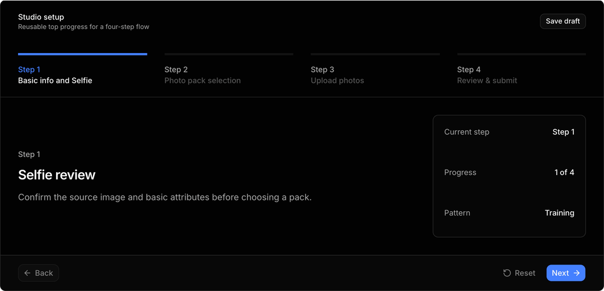
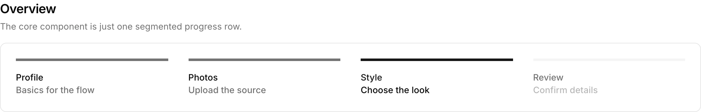
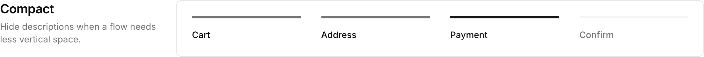
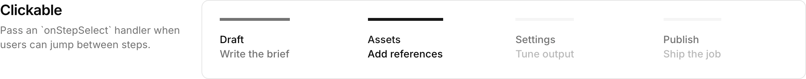
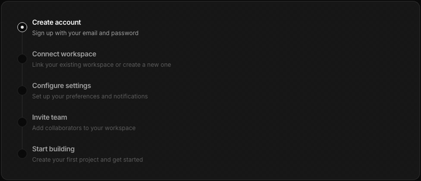
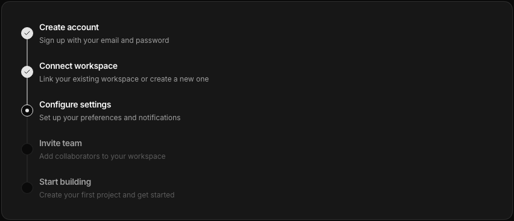
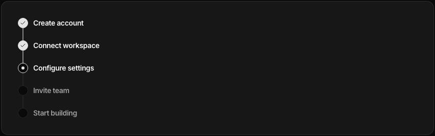
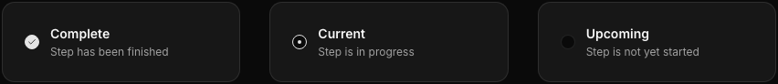
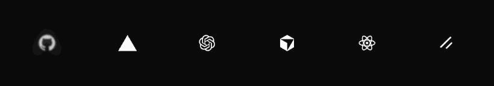
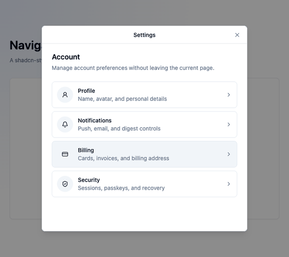

# custom-ui

Personal collection of composable UI components built on [shadcn/ui](https://ui.shadcn.com) conventions.

## Install

```bash
npx shadcn@latest add https://raw.githubusercontent.com/addisonk/custom-ui/main/registry.json
```

## Components

### Cell

A composable list-cell component with start, content, and end slots. Variants
follow the shadcn convention: `ghost` (default), `outline`, and `muted`.

```tsx
import {
  Cell,
  CellContent,
  CellDescription,
  CellEnd,
  CellStart,
  CellTitle,
} from "@/components/custom-ui/cell";

<Cell variant="outline">
  <CellStart>
    <Avatar />
  </CellStart>
  <CellContent>
    <CellTitle>Title</CellTitle>
    <CellDescription>Description</CellDescription>
  </CellContent>
  <CellEnd>
    <ChevronRight />
  </CellEnd>
</Cell>
```

Sub-components: `Cell`, `CellStart`, `CellContent`, `CellLabel`, `CellTitle`, `CellDescription`, `CellNote`, `CellEnd`, `CellSkeleton`

### Survey Dialog

A multi-step form dialog with forward/back navigation, per-step field
validation (React Hook Form + Zod), and a progress bar. Steps are declared as
data; each step renders its own fields and lists which fields to validate
before advancing.

```tsx
import { SurveyDialog, useSurvey } from "@/components/custom-ui/survey-dialog";
import { z } from "zod";

const schema = z.object({
  name: z.string().min(1),
  role: z.string().min(1),
});

<SurveyDialog
  open={open}
  onOpenChange={setOpen}
  title="Onboarding"
  schema={schema}
  defaultValues={{ name: "", role: "" }}
  steps={[
    { title: "Your name", fields: ["name"], render: () => <NameStep /> },
    { title: "Your role", fields: ["role"], render: () => <RoleStep /> },
  ]}
  onComplete={async (data) => {
    await save(data);
  }}
/>;
```

Step components read the form via React Hook Form's `useFormContext()` and can
drive navigation with the `useSurvey()` hook (`goToNextStep`, `goBack`,
`direction`, `isFirst`). Set `hideFooter: true` on a step to render your own
navigation controls.

### Steps

A segmented steps navigation component for showing where someone is in a
multi-step process. It can derive complete/current/upcoming state from the
current step, or accept explicit `status` values when the flow owns that state.

```bash
npx shadcn@latest add https://raw.githubusercontent.com/addisonk/custom-ui/main/public/r/steps.json
```

```tsx
import { Steps } from "@/components/custom-ui/steps";

const steps = [
  { id: "basic-info", title: "Step 1", description: "Basic info and Selfie" },
  { id: "photo-pack", title: "Step 2", description: "Photo pack selection" },
  { id: "upload-photos", title: "Step 3", description: "Upload photos" },
  { id: "review", title: "Step 4", description: "Review & submit" },
];

<Steps steps={steps} currentStep="photo-pack" />;
```

The completed, current, and upcoming states are intentionally distinct: past
steps keep readable labels with a completed border, the current step takes the
primary emphasis, and upcoming steps stay muted.









### Stepper

A composable, animated vertical stepper component. Use this when each step
needs its own indicator, connector, title, and optional description. It is lower
level than `Steps`: you compose the individual pieces, and your app owns the
step state.

```bash
npx shadcn@latest add https://raw.githubusercontent.com/addisonk/custom-ui/main/public/r/stepper.json
```

```tsx
import {
  Stepper,
  StepperContent,
  StepperDescription,
  StepperIndicator,
  StepperItem,
  StepperSeparator,
  StepperTitle,
} from "@/components/custom-ui/stepper";

<Stepper>
  <StepperItem status="complete">
    <StepperIndicator />
    <StepperContent>
      <StepperTitle>Create account</StepperTitle>
      <StepperDescription>Sign up with your email</StepperDescription>
    </StepperContent>
    <StepperSeparator />
  </StepperItem>
  <StepperItem status="current">
    <StepperIndicator />
    <StepperContent>
      <StepperTitle>Configure settings</StepperTitle>
      <StepperDescription>Set up your preferences</StepperDescription>
    </StepperContent>
    <StepperSeparator />
  </StepperItem>
  <StepperItem status="upcoming">
    <StepperIndicator />
    <StepperContent>
      <StepperTitle>Start building</StepperTitle>
      <StepperDescription>Create your first project</StepperDescription>
    </StepperContent>
  </StepperItem>
</Stepper>
```

`Stepper` accepts `size="sm" | "default" | "lg"`. `StepperItem` accepts
`status="complete" | "current" | "upcoming"`.









### Logo Cloud

An animated logo cloud that cycles through sets of logos with a staggered
scale, opacity, and blur transition. It pauses on hover, respects
`prefers-reduced-motion`, and receives every logo via props so it can be reused
with image assets, JSX wordmarks, or text fallbacks.
By default the logos render unframed; use `cellClassName` when a surface needs
bordered or filled logo cells.



```bash
npx shadcn@latest add https://raw.githubusercontent.com/addisonk/custom-ui/main/public/r/logo-cloud.json
```

```tsx
import {
  LogoCloud,
  type LogoCloudItem,
} from "@/components/custom-ui/logo-cloud";

const logos: LogoCloudItem[] = [
  { name: "Peloton", src: "/logos/peloton.svg" },
  { name: "Sweetgreen", src: "/logos/sweetgreen.svg" },
  { name: "Handshake", src: "/logos/handshake.svg" },
  {
    name: "Northstar",
    logo: <span className="text-sm font-semibold">NORTHSTAR</span>,
  },
];

<LogoCloud logos={logos} setSize={6} interval={4000} />;
```

Use `cellClassName`, `logoClassName`, and `gridClassName` to tune the visual
treatment for a specific brand surface.

### Navigator Dialog

An N-level drill-in dialog. Open a dialog, navigate _into_ sub-views to edit
things, then go _back_ — an arbitrary-depth view stack inside a single Radix
Dialog (real focus trap, `Esc`, scroll lock). Forward navigation slides in from
the right, back navigation from the left. It uses shadcn's `DialogContent`,
`DialogTitle`, `DialogDescription`, and `DialogFooter`, but swaps the standard
close button for a fixed 44px navigation bar with an absolutely centered view
name and left/right actions. The standard shadcn `DialogHeader` still renders
below that bar. The dialog shell keeps a stable default height so deeper views
do not resize or re-center the modal; the body scrolls when content is tall.
Where `SurveyDialog` is a _linear_ multi-step form,
`NavigatorDialog` is _non-linear_ drill-in navigation.

The example below drills from Settings to Profile, then into Personal info, then
into Display name before navigating back up the stack.



```tsx
import {
  NavigatorDialog,
  useNavigator,
} from "@/components/custom-ui/navigator-dialog";
import { Button } from "@/components/ui/button";

function MenuView() {
  const { navigate } = useNavigator();
  return (
    <div className="flex flex-col gap-4">
      <button onClick={() => navigate("edit-name")}>Edit name</button>
      <button onClick={() => navigate("edit-email")}>Edit email</button>
    </div>
  );
}

<NavigatorDialog
  open={open}
  onOpenChange={setOpen}
  initialView="menu"
  views={[
    {
      id: "menu",
      name: "Settings",
      title: "Account",
      description: "Update the things you'd like.",
      render: () => <MenuView />,
    },
    {
      id: "edit-name",
      name: "Profile",
      title: "Edit name",
      render: () => <NameForm />,
      footer: ({ back }) => (
        <>
          <Button variant="outline" onClick={back}>Cancel</Button>
          <Button form="name-form" type="submit">Save</Button>
        </>
      ),
    },
    {
      id: "edit-email",
      name: "Email",
      title: "Edit email",
      render: () => <EmailForm />,
    },
  ]}
/>;
```

Each view's `name` is its short navigation-bar label, centered in the fixed top
bar. `title` and `description` render in the standard shadcn `DialogHeader`
below that bar, using `DialogTitle` and `DialogDescription`. Views own the body
content below the header, and can provide `footer` actions that render in a
standard shadcn `DialogFooter`.

Views are declared as data and own their own state — the dialog owns only
navigation. Any view can drive navigation through render props or the
`useNavigator()` hook (`navigate`, `back`, `canGoBack`, `activeViewId`,
`stack`). A Back button appears in the navigation bar automatically at depth;
the dialog's close button always dismisses the whole dialog. The view stack resets
to `initialView` on close.

## Blocks

### Settings Dialog

A worked example that composes `NavigatorDialog` with `Cell` — a drill-in
settings dialog: a `Cell`-based menu that navigates into editable sub-views.
Installing it pulls `navigator-dialog` and `cell` with it. Copy it in and
adapt the views to your own settings; the content is placeholder.

```tsx
import { SettingsDialog } from "@/components/custom-ui/settings-dialog";

function Example() {
  const [open, setOpen] = useState(false);
  return (
    <>
      <Button onClick={() => setOpen(true)}>Settings</Button>
      <SettingsDialog open={open} onOpenChange={setOpen} />
    </>
  );
}
```

`SettingsDialog` is the reference for using `Cell` as the row primitive inside
a `NavigatorDialog` menu — each row is a `Cell` rendered `asChild` as a button
that calls `navigate()`.
